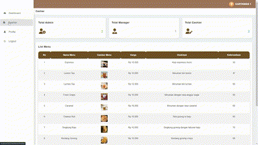
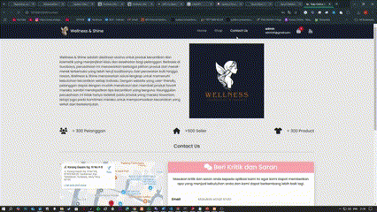
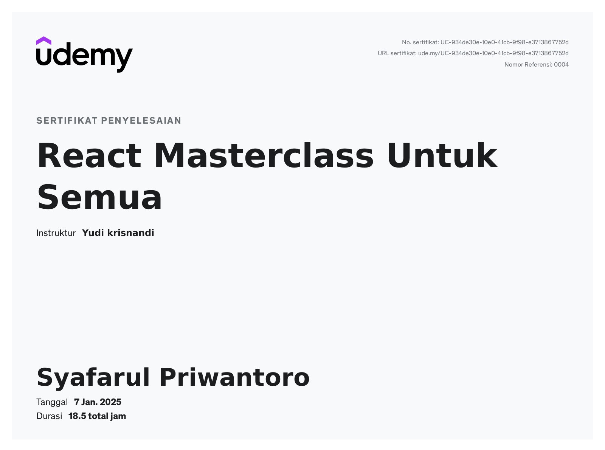
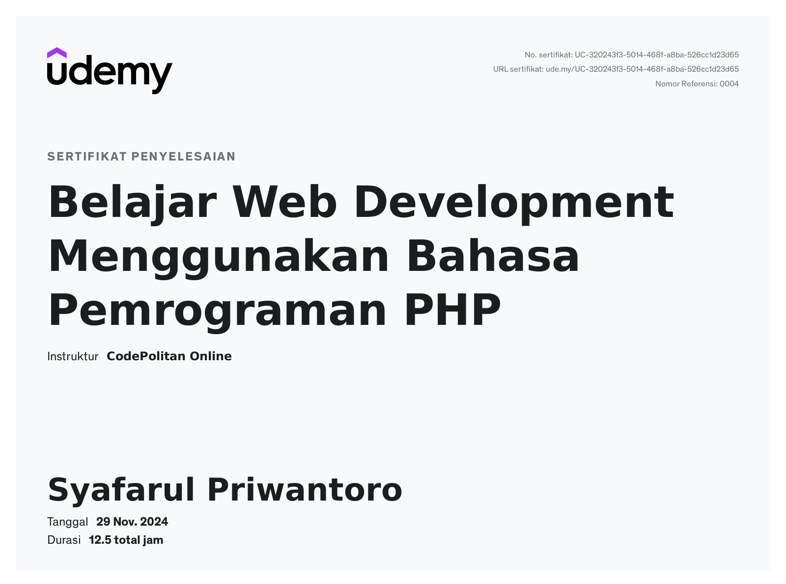

# Hi 👋, I'm Syafarul Priwantoro
### 🚀 Passionate Software Developer & Cloud Enthusiast

---

  🎓 Currently studying Information Systems at <strong>Telkom University Surabaya</strong> 
  📍 Based in Surabaya, Indonesia 
  💼 Focused on Backend & Frontend Development 
  🌐 Exploring Cloud Computing, DevOps, and System Architecture

  

---

### 🔠 About Me

- 🌱 Currently enhancing my skills in **HTML, CSS, PHP, Laravel, Python, Java, and Web Development**.  
- 👨‍💻 Check out my latest works on [my portfolio website](https://farul1.github.io/Syafarul_Portofolio/).  
- 🗲 Passionate about **Web Development**, **Best Practices**, and **Cloud Solutions**.  
- 💬 Open to collaborations in **Backend/Frontend Development**, **Cloud Architecture**, and **DevOps**.  
- 📧 Reach me at **syafarul.priwantoro@gmail.com** or connect via [LinkedIn](https://www.linkedin.com/in/syafarul-priwantoro-036039197/).  

---

### 🛠️ Tools & Technologies

 
  

---

### 🌟 Featured Projects

#### 🚀 **[Cafe VNT with Midtrans Payment](https://github.com/farul1/Kasir_CafeVNT)**
A complete cafe POS system with seamless Midtrans payment integration for better customer experience.  

  

#### ⚙️ **[Cafe VNT Jenkins Pipeline](https://github.com/farul1/Kasir_CafeVNT/blob/main/Jenkinsfile)**
CI/CD implementation for Cafe VNT project using Jenkins, automating builds and deployments.  

  

#### 🚌 **[Fastline Bus Booking System](https://github.com/farul1/Fastline)**
Efficient bus booking system with a user-friendly interface for optimal booking management.  

  

#### 💄 **[Wellness Shine](https://github.com/farul1/Wellnes_shine)**
An innovative cosmetic store platform showcasing vibrant e-commerce design and functionality.  

  

### 🎥 Ubuntu Video Remastering

  

Click pada gambar untuk menonton lebih lanjut..

  

---

### 📜 Certifications

- **[React Master - Udemy](https://www.udemy.com/certificate/UC-934de30e-10e0-41cb-9f98-e3713867752d/):**  
  Comprehensive training in React programming for foundational skills.  

  

- **[Web Development Pemro PHP - Udemy](https://www.udemy.com/certificate/UC-320243f3-5014-468f-a8ba-526cc1d23d65/):**  
  Completion certificate for a PHP web development course (12.5 hours).  

  

---

### 📊 GitHub Highlights

  

  

  

---

### 🌐 Connect with Me

  
  
  

## 🚀 GitHub Actions: Automating Snake Animation

In this project, I use **GitHub Actions** to automatically generate a Snake animation every time there is a push or pull request to the `main` branch.

Here is the Snake animation generated by GitHub Actions:

  

  

